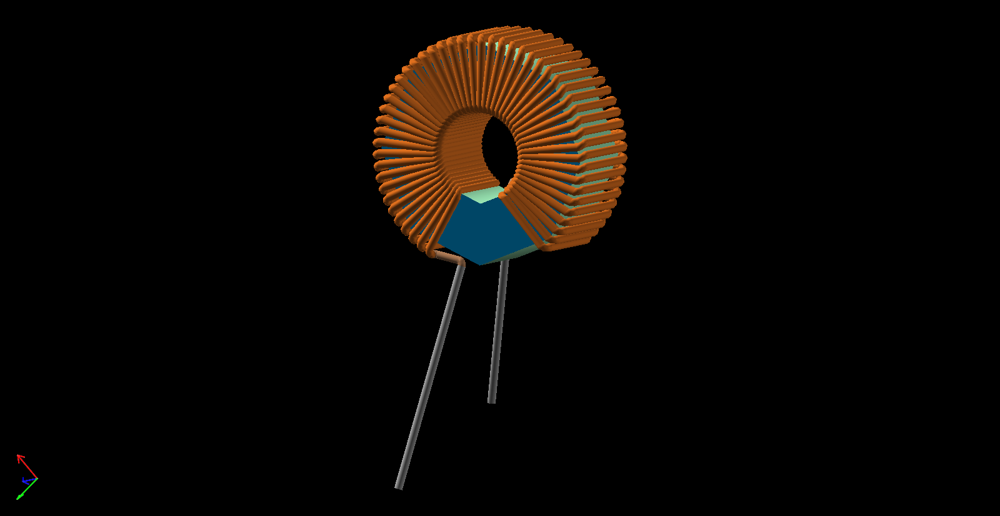
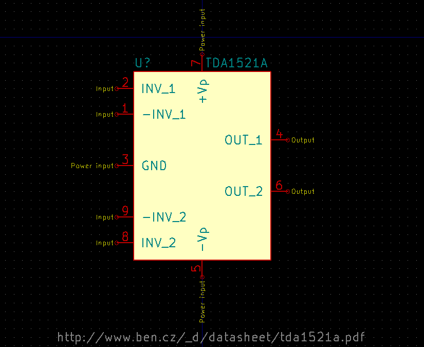

# kicad-lib [](LICENSE)
Web was missing some symbols/models/footprints for some electronics components I was using: that's them

3D models are provided as a [SolveSpace](//solvespace.com) model,
	an interactive Three.js model (linked in headers),
	a STEP file, which (currently) [doesn't include the colours](https://github.com/solvespace/solvespace/issues/452)
	(if you're familiar with ISO-10303-21, do please consider supporting the aforementioned issue),
	and a WRL file (NB: exported at 1:2.54 scale from SolveSpace to match KiCad's scaling),
	the latter two of which can be used directly by KiCad.

Symbols are provided as individual KiCad libraries.

Footprints are provided as individual importable `.kicad_mod`s.

## 3D models

### [SOT110-1](https://rawcdn.githack.com/nabijaczleweli/kicad-lib/master/models/SOT110-1/SOT110-1.html)


### [TO-220 5-lead](https://rawcdn.githack.com/nabijaczleweli/kicad-lib/master/models/TO-220%205-lead/TO-220%205-lead.html)


### [TO-220 5-lead pitch-aligned at end of shortest lead](https://rawcdn.githack.com/nabijaczleweli/kicad-lib/master/models/TO-220%205-lead%20pitch-aligned-end/TO-220%205-lead%20pitch-aligned-end.html)


### [L_Radial_D6.8mm_5.0mm_P2.54mm_sleeved](https://rawcdn.githack.com/nabijaczleweli/kicad-lib/master/models/L_Radial_D6.8mm_5.0mm_P2.54mm_sleeved/L_Radial_D6.8mm_5.0mm_P2.54mm_sleeved.html)


### [L_Toroid_Vertical_L14.5mm_W7.0mm_P7.18mm](https://rawcdn.githack.com/nabijaczleweli/kicad-lib/master/models/L_Toroid_Vertical_L14.5mm_W7.0mm_P7.18mm/L_Toroid_Vertical_L14.5mm_W7.0mm_P7.18mm.html)



### [Aavid twist-finned TO-220 heatsink](https://rawcdn.githack.com/nabijaczleweli/kicad-lib/master/models/Aavid%20twist-finned%20TO-220%20heatsink/Aavid%20twist-finned%20TO-220%20heatsink.html)


### [LED 2x4x7mm](https://rawcdn.githack.com/nabijaczleweli/kicad-lib/master/models/LED%202x4x7mm/LED%202x4x7mm.html)


The default resin colour here is magenta,
	but you can easily adapt it be anything by changing the RGB values in the following section of [LED 2x4x7mm.wrl](models/LED%202x4x7mm/LED%202x4x7mm.wrl):

```wrl
        color Color { color [
          1.0000000000 0.0000000000 1.0000000000,
        ] }
```

## Symbols

### TDA1521A



### LT1070/LT1071


## Footprints

### TO-220 5-lead pitch-aligned at end of shortest lead


### L_Radial_D6.8mm_5.0mm_P2.54mm_sleeved


### L_Toroid_Vertical_L14.5mm_W7.0mm_P7.18mm


### Heatsink_Aavid-5342-TO220_Vertical


## Special thanks

To all who support further development on Patreon, in particular:

  * ThePhD
